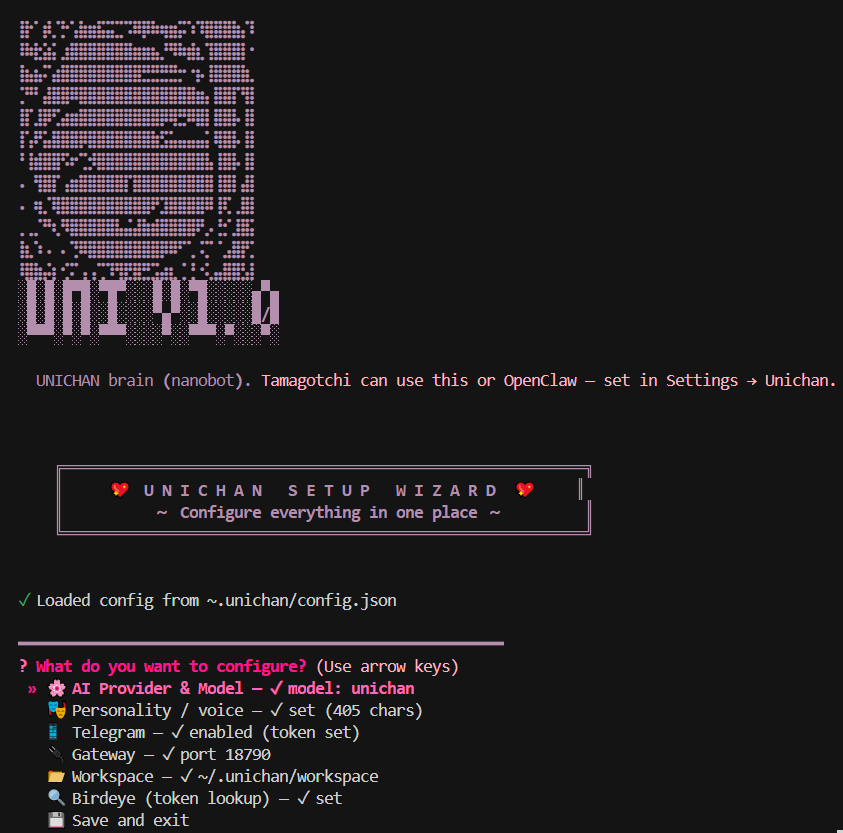
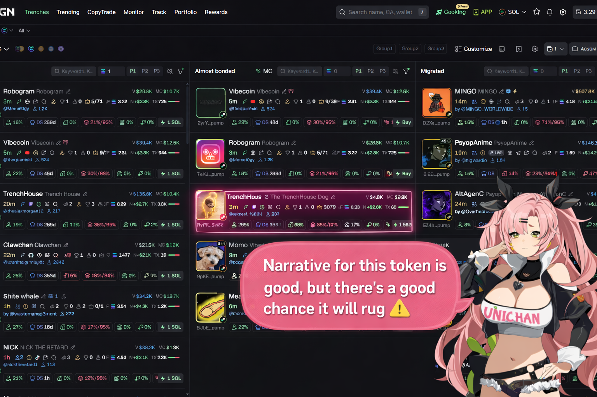

# UNICHAN MVP

**$UNI** — [2BHda5VYTfZzX9DnxjjnPLajG6pUteDSQZQYndDkpump](https://pump.fun/coin/2BHda5VYTfZzX9DnxjjnPLajG6pUteDSQZQYndDkpump)

**UNICHAN** is an AI avatar that lives where you do: on your **desktop**, in **Telegram**, and in your **browser** (Chrome extension). She’s a helpful companion that can spot trades, analyze tokens, and act as a wallet with smart buy/sell management—all through one brain (BRAIN) and one character (Tamagotchi + extension).


---

## What’s in this repo

| Part | What it is | Role |
|------|------------|------|
| **BRAIN** | Python nanobot (AI agent) | HTTP gateway: chat, token research, trading tools, skills. Runs on port **18790**. |
| **TAMAGOTCHI** | Electron desktop app | UNICHAN avatar on your desktop: Live2D character, voice, chat, screen. Connects to the UNICHAN brain (nanobot) or **OpenClaw**; exposes WebSocket on port **6121** for the browser extension. |
| **CHROME-EXTENSION** | Browser extension (WXT) | UNICHAN in your browser: sends page context (title, URL, video/subtitles) to the avatar so she can see what you see, spot trades, and analyze tokens. |

**Full documentation:** [docs/README.md](docs/README.md) — getting started, each component, and architecture.

---

## Prerequisites

- **Node.js** (v20+) and **pnpm** — for Tamagotchi and the Chrome extension
- **Python 3** — for the BRAIN (nanobot)
- **Chrome** — to load the extension

---

## Quick start (install & run)

Do these in order:

### 1. Clone and install

```bash
git clone https://github.com/dogtoshi-sz/unichan-mvp
cd unichan-mvp
pnpm install
pnpm build:packages
```


### 2. Run the BRAIN

The BRAIN is the AI. Tamagotchi talks to it over HTTP. Leave this running.

```bash
cd BRAIN
pip install -e .
unichan onboard   # First time only: API key, workspace
unichan gateway   # Starts HTTP API on port 18790
```

First-time setup runs the **onboard wizard** (AI provider, personality, Telegram, gateway port, workspace, Birdeye). You’ll see something like this:



Or create `~/.unichan/config.json` manually (see [BRAIN/README.md](BRAIN/README.md) and `BRAIN/config.example.json`).

### 3. Run Tamagotchi (desktop avatar)

From the **UNICHAN-MVP** root:

```bash
pnpm dev:tamagotchi
```

In the app:

1. **Settings → Unichan** — Gateway URL: `http://localhost:18790/v1/` → Test → Save.
2. **Settings → Consciousness** — Choose **OpenClaw (Unichan brain)** (this option works for both the UNICHAN brain and OpenClaw).
3. Turn on the mic if you want voice.

**Using OpenClaw instead of the UNICHAN brain:** Tamagotchi can connect to [OpenClaw](https://openclaw.ai) instead of the nanobot. In OpenClaw’s config (`~/.openclaw/openclaw.json`), enable the HTTP chat endpoint (see [Tamagotchi → OpenClaw](docs/tamagotchi/README.md#connecting-to-openclaw)). Then in Tamagotchi: **Settings → Unichan** set the gateway URL and port (e.g. `http://localhost:18789/v1/` if OpenClaw runs on 18789), model **openclaw**, and **Settings → Consciousness** → **OpenClaw (Unichan brain)**.

### 4. Build and load the Chrome extension

From the **UNICHAN-MVP** root:

```bash
pnpm build:extension
```

In Chrome:

1. Open `chrome://extensions`, turn on **Developer mode**.
2. **Load unpacked** → select folder: `CHROME-EXTENSION/.output/chrome-mv3` (inside your clone).
3. In the extension popup: WebSocket URL `ws://localhost:6121/ws`, enable it, enable **Page context**, then **Apply**.

### 5. Use it

- **Desktop** — Talk or type to UNICHAN in the Tamagotchi app; she’s your companion with voice and chat.
- **Browser** — Use the Chrome extension; she sees what you’re browsing and can spot trades, analyze tokens, and answer questions about the page.
- **Telegram** — (Optional) Connect the BRAIN to Telegram so UNICHAN can help you there too.
- One avatar, one brain: token research, smart buy/sell ideas, and wallet-style management flow through the same UNICHAN.

**See it in action:** UNICHAN on a token dashboard (GMGN), with the avatar spotting trades and giving context-aware warnings:



Video walkthrough: [tomigatchi-example.mp4](tomigatchi-readme/tomigatchi-example.mp4)

---

## Repo structure

```
UNICHAN-MVP/
├── BRAIN/              # Python nanobot (nanobot + bridge)
├── TAMAGOTCHI/         # Electron desktop app (UNICHAN Avatar)
├── CHROME-EXTENSION/   # WXT browser extension
├── packages/           # Shared packages (stage-ui, server-sdk, etc.)
├── docs/               # Full documentation
├── package.json
└── pnpm-workspace.yaml
```

---

## Connections & ports

| From | To | Protocol | Port |
|------|----|----------|------|
| Chrome Extension | Tamagotchi | WebSocket | 6121 |
| Tamagotchi | BRAIN | HTTP | 18790 |

Chat and AI always go through **Tamagotchi** (the avatar); the extension only provides browser context. One avatar, one brain: desktop, Telegram, and browser share the same UNICHAN.

---

## Troubleshooting

- **Extension: “Connection error”** — Tamagotchi must be running and WebSocket URL must be `ws://localhost:6121/ws`.
- **Tamagotchi: no chat** — BRAIN must be running; in Settings → Unichan set gateway to `http://localhost:18790/v1/` and Test.
- **Extension popup blank** — Load the **production** build: `CHROME-EXTENSION/.output/chrome-mv3`, not `chrome-mv3-dev`.

More: [docs/README.md](docs/README.md) and [Chrome Extension troubleshooting](docs/chrome-extension/troubleshooting.md).

---

## License

MIT.
