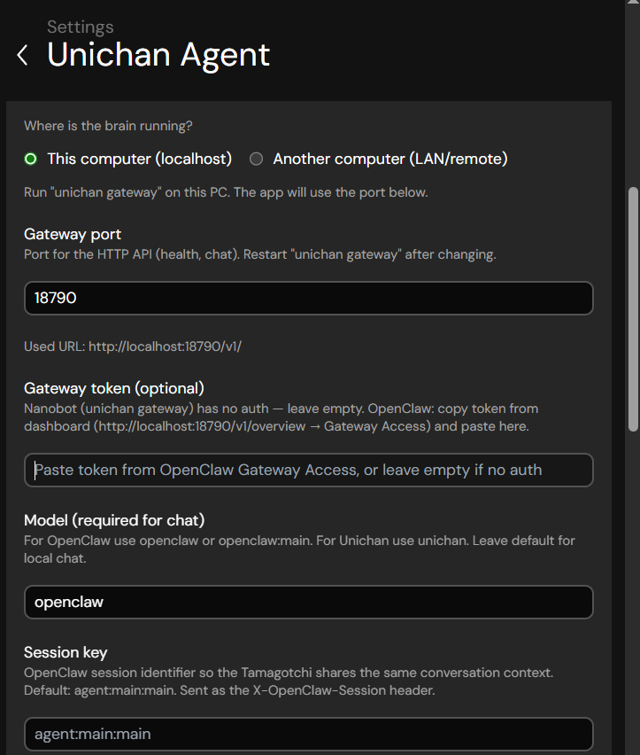

# UNICHAN install steps (with talking points)

Short checklist for installing and running UNICHAN. Full details: [Getting Started](getting-started.md), [README](../README.md).

---

## Prerequisites

- **Node.js** (v20+) and **pnpm** — Tamagotchi + Chrome extension  
- **Python 3** — only if you use the UNICHAN brain (nanobot)  
- **Chrome** — for the extension  

---

## 0. Clone and install (once)

```bash
git clone https://github.com/dogtoshi-sz/unichan-mvp
cd unichan-mvp
pnpm install
pnpm build:packages
```

---

## 1. Set up the gateway (OpenClaw or UNICHAN brain)

**Talking points:**

- UNICHAN has **one avatar** (Tamagotchi) and **one brain** (gateway). You choose the brain: **UNICHAN v1.0 (nanobot)** or **OpenClaw**.
- **UNICHAN brain:** Python nanobot, runs on this machine, port **18790**. First-time setup with `unichan onboard` (API key, personality, Telegram, Birdeye). No extra install if you already use Python.
- **OpenClaw:** Use your existing OpenClaw install. You must **enable the HTTP chat endpoint** in OpenClaw’s config so Tamagotchi can talk to it (OpenClaw doesn’t expose it by default). Then point Tamagotchi at OpenClaw’s URL (e.g. port **18789**).
- Both expose an **OpenAI-compatible HTTP API**; Tamagotchi is the client. Chat and tools (token research, trading) go through whichever gateway you choose.

**If using UNICHAN brain (nanobot):**

- Config lives in `~/.unichan/config.json`. Create it via the onboard wizard or manually (see `BRAIN/config.example.json`).
- Gateway port default: **18790**. Tamagotchi will use `http://localhost:18790/v1/`.

**If using OpenClaw:**

- Edit **`~/.openclaw/openclaw.json`** (Windows: `%USERPROFILE%\.openclaw\openclaw.json`).
- Under `"gateway"` add:
  ```json
  "http": {
    "endpoints": {
      "chatCompletions": { "enabled": true }
    }
  }
  ```
- Restart OpenClaw (e.g. `openclaw gateway --port 18789`). Use that host/port in Tamagotchi later.

---

## 2. Run the gateway (only if using UNICHAN brain)

Leave this terminal open.

```bash
cd BRAIN
pip install -e .
unichan onboard   # First time only: wizard (API key, workspace, etc.)
unichan gateway   # Starts HTTP API on port 18790
```

- **OpenClaw users:** Run your OpenClaw gateway as you normally do (e.g. `openclaw gateway --port 18789`). Skip the `unichan` commands.

---

## 3. Run the Tamagotchi

From the **repo root**:

```bash
pnpm dev:tamagotchi
```

In the app:

1. **Settings → Unichan**
   - **UNICHAN brain:** “This computer”, port **18790**, model **unichan** (or leave default). Test → Save.
   - **OpenClaw:** “Another computer” (or “This computer” if OpenClaw is local), URL e.g. `http://localhost:18789/v1/`, model **openclaw** → Test → Save.
2. **Settings → Consciousness** → **OpenClaw (Unichan brain)** (same option for both brains).

   
3. Turn on mic if you want voice.

Tamagotchi exposes a **WebSocket on port 6121** for the Chrome extension. Leave the app running.

---

## 4. Build the Chrome extension

From the **repo root**:

```bash
pnpm build:extension
```

Output folder: **`CHROME-EXTENSION/.output/chrome-mv3`** (use this for “Load unpacked”, not `chrome-mv3-dev`).

---

## 5. Set up the Chrome extension (same for UNICHAN brain or OpenClaw)

The extension talks only to **Tamagotchi**, not to the brain. Brain choice is already done in Tamagotchi (step 3).

1. Open **Chrome** → **chrome://extensions** → turn on **Developer mode**.
2. **Load unpacked** → select **`CHROME-EXTENSION/.output/chrome-mv3`** (inside your clone).
3. Open the extension popup:
   - **WebSocket URL:** `ws://localhost:6121/ws`
   - Turn **Enable** on.
   - Enable **Page context** (and Video/Subtitles if you want).
   - Click **Apply**.

If you see **Connection error**, Tamagotchi isn’t running or the WebSocket URL is wrong. Fix and click **Apply** again.

---

## Optional

- **Telegram:** Configure in the UNICHAN brain (`unichan onboard` or `~/.unichan/config.json`). Tamagotchi doesn’t need a separate Telegram setting for that.
- **Ports recap:** Tamagotchi ↔ BRAIN/OpenClaw = **HTTP** (18790 or your OpenClaw port). Extension ↔ Tamagotchi = **WebSocket 6121**.

---

## Quick reference

| Step | What | Command / Where |
|------|------|------------------|
| 0 | Clone & install | `pnpm install` + `pnpm build:packages` |
| 1 | Gateway config | UNICHAN: `~/.unichan/config.json` or `unichan onboard`. OpenClaw: `~/.openclaw/openclaw.json` + `chatCompletions` enabled. |
| 2 | Run gateway | UNICHAN: `unichan gateway`. OpenClaw: `openclaw gateway --port 18789` (or your port). |
| 3 | Run Tamagotchi | `pnpm dev:tamagotchi` → Settings → Unichan + Consciousness |
| 4 | Build extension | `pnpm build:extension` |
| 5 | Load extension | chrome://extensions → Load unpacked → `.output/chrome-mv3` → popup: `ws://localhost:6121/ws`, Enable, Apply |

More: [Getting Started](getting-started.md), [Tamagotchi → OpenClaw](tamagotchi/README.md#connecting-to-openclaw), [Chrome Extension](chrome-extension/README.md).
