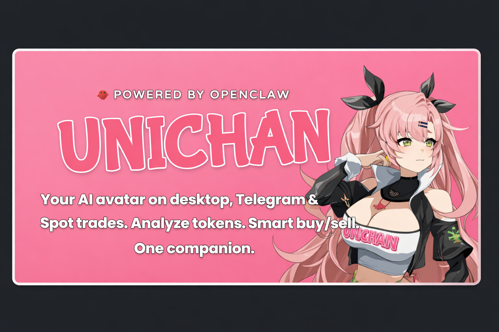

# UNICHAN Documentation

UNICHAN is an **AI avatar** that lives on your **desktop**, in **Telegram**, and in your **browser**. She’s a helpful companion that can spot trades, analyze tokens, and act as a wallet with smart buy/sell management—powered by one brain (BRAIN) and one character (Tamagotchi + Chrome extension).



---

## Source code

**[UNICHAN MVP on GitHub](https://github.com/dogtoshi-sz/unichan-mvp)** — Clone, open issues, and contribute.

---

## The three pillars

| Component | What it is | Role |
|-----------|------------|------|
| **Tamagotchi (UNICHAN Avatar)** | Desktop app (Electron) with a Live2D character | The avatar on your desktop: voice, chat, reactions. Uses the BRAIN for chat, token research, and trading tools. Also connects to Telegram and the browser extension. |
| **BRAIN** | Python nanobot | AI gateway: chat, token research, trading skills, smart buy/sell logic. HTTP API on port 18790. |
| **Chrome Extension** | Browser extension (WXT) | UNICHAN in your browser: sends page context so she can see what you see, spot trades, and analyze tokens. |

---

## How they connect

```
┌─────────────────────┐     WebSocket (6121)      ┌──────────────────────┐     HTTP (18790)      ┌─────────────┐
│  Chrome Extension   │ ───────────────────────► │  Tamagotchi (Avatar) │ ────────────────────► │    BRAIN    │
│  (page context,     │   page / video /          │  Live2D, voice,      │   chat, tools,        │  (nanobot)  │
│   video, subtitles) │   subtitles              │  OpenClaw UI         │   token research     │  gateway    │
└─────────────────────┘                           └──────────────────────┘                       └─────────────┘
```

- **Extension → Tamagotchi:** Browser context over WebSocket (port 6121).
- **Tamagotchi → BRAIN:** Chat and tools over HTTP (port 18790).

Chat and AI always go through **Tamagotchi**. The extension only provides context. Configure the brain in **Settings → Unichan** inside the Tamagotchi app.

**OpenClaw option:** Tamagotchi can use the UNICHAN brain (nanobot) or **[OpenClaw](https://openclaw.ai)**. To use OpenClaw, enable its HTTP chat endpoint and point Tamagotchi at it — see [Tamagotchi → Connecting to OpenClaw](tamagotchi/README.md#connecting-to-openclaw).

---

## Documentation index

| Doc | Description |
|-----|--------------|
| [**Install steps (with talking points)**](INSTALL-STEPS.md) | Short checklist: gateway (OpenClaw or UNICHAN brain), run gateway, Tamagotchi, build/setup Chrome extension. |
| [Getting Started](getting-started.md) | Install and run all three pieces step by step. |
| [Tamagotchi (UNICHAN Avatar)](tamagotchi/README.md) | Desktop character, OpenClaw interface, reactions. |
| [BRAIN](brain/README.md) | Nanobot, skills, gateway, config. |
| [Chrome Extension](chrome-extension/README.md) | What the extension sends, setup, research features. |
| [Architecture](architecture.md) | Repo layout, ports, and data flow. |
