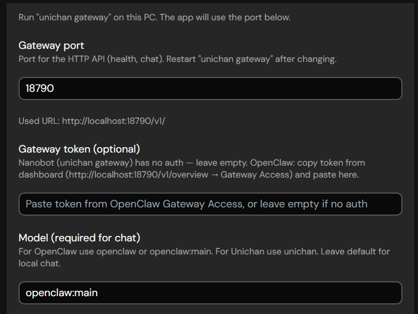

# OpenClaw / Nanobot interface

The UNICHAN avatar (Tamagotchi) can use either the **UNICHAN brain (nanobot)** or **[OpenClaw](https://openclaw.ai)**. Both expose an OpenAI-compatible HTTP API; Tamagotchi is the client. To connect Tamagotchi to OpenClaw instead of the nanobot, see [Tamagotchi → Connecting to OpenClaw](README.md#connecting-to-openclaw).

---

## What the avatar can do with the BRAIN

- **Chat** — Your messages (and optional browser context from the extension) are sent to the BRAIN. The BRAIN runs the LLM and tools; replies are streamed back to the Tamagotchi and drive the character’s responses.
- **Tools & skills** — The BRAIN can use skills (e.g. GitHub, weather, summarize, token research). The Tamagotchi sends tool calls through the gateway and displays or speaks the results.
- **Token research** — If the BRAIN is configured with token research (e.g. Birdeye), the avatar can answer token-related questions; the Chrome extension can send page/URL context so she knows what you’re looking at.

---

## How it’s configured

- **Gateway URL** — In Tamagotchi: **Settings → Unichan**. Set this to your BRAIN HTTP base URL (e.g. `http://localhost:18790/v1/`). This is the only place you configure the BRAIN for the avatar.
- **Consciousness** — **Settings → Consciousness → OpenClaw (Unichan brain)** tells the app to use that gateway for chat and tools.

The Chrome extension does **not** connect to the BRAIN. It only sends context to the Tamagotchi; the Tamagotchi then includes that context when calling the BRAIN.

---

## Making the avatar use browser context

Tamagotchi already injects browser context (page, video, subtitles) from the extension into each turn. To have her refer to what you’re browsing more proactively, you can add to her **system prompt** (e.g. in Settings → Character/Card):

*“You can see what the user is browsing via a Chrome extension: current page title/URL, and on YouTube/Bilibili the video title and live subtitles. Use this when relevant. The user may ask you to analyze a token chart, check Twitter for a token, or summarize a page.”*

This keeps the OpenClaw/nanobot behavior while making the avatar clearly “see” the browser.
